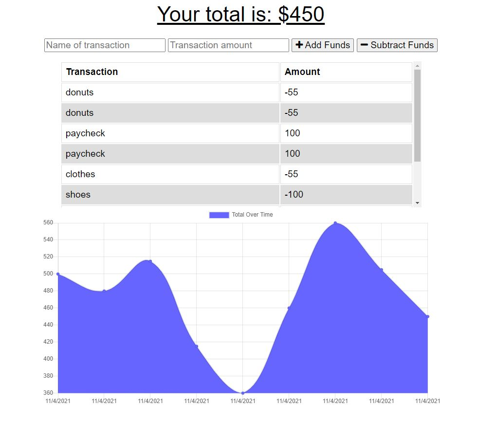

# offline-budget-tracker

## Description
- We were asked to finish an app that tracks your budget, with an emphasis on offline functionality in case of use in poor connection areas.
- This app let's you keep track your budget with a simple interface and a helpful graph.
- This project helped us learn about IndexDB and service-worker.js.
## Table of Contents
- [Installation](#installation)
- [Usage](#usage)
- [Credits](#credits)
- [License](#license)
## Installation
- You will need to use 'npm i' in a command line if you clone the app down from the repo. This will give you access to the packages needed to run this app.
- Github repo is here: https://github.com/aidanrich/offline-budget-tracker
## Usage
- You can use the live app on Heroku: https://aqueous-citadel-52972.herokuapp.com
- On the main page you can input an item with a corresponding dollar amount which you can either add or subtract from your total budget. When you hit submit you will see the item appear below and the graph will change to illustrate the change to your total budget.

   
## Credits
- We used a lot of boiler plate code from our activities and starter code provided by the assignment.
- Lots of help from my tutor Dru Sanchez.

## Badges

## License
- MIT License

Copyright (c) [2021] [Aidan Rich]

Permission is hereby granted, free of charge, to any person obtaining a copy of this software and associated documentation files (the "Software"), to deal in the Software without restriction, including without limitation the rights to use, copy, modify, merge, publish, distribute, sublicense, and/or sell copies of the Software, and to permit persons to whom the Software is furnished to do so, subject to the following conditions:

The above copyright notice and this permission notice shall be included in all copies or substantial portions of the Software.

THE SOFTWARE IS PROVIDED "AS IS", WITHOUT WARRANTY OF ANY KIND, EXPRESS OR IMPLIED, INCLUDING BUT NOT LIMITED TO THE WARRANTIES OF MERCHANTABILITY, FITNESS FOR A PARTICULAR PURPOSE AND NONINFRINGEMENT. IN NO EVENT SHALL THE AUTHORS OR COPYRIGHT HOLDERS BE LIABLE FOR ANY CLAIM, DAMAGES OR OTHER LIABILITY, WHETHER IN AN ACTION OF CONTRACT, TORT OR OTHERWISE, ARISING FROM, OUT OF OR IN CONNECTION WITH THE SOFTWARE OR THE USE OR OTHER DEALINGS IN THE SOFTWARE.
